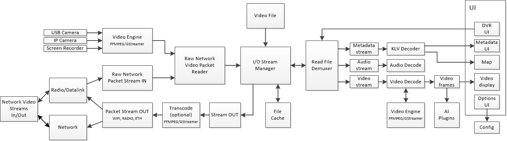

# open-dvr
An open source DVR project for tactical video operations.

## Mission Statement

Our mission is to build a foundational open-source project dedicated to advanced video operations, including high-performance playback, digital video recording (DVR), precise video inspection, and seamless streaming orchestration. While excellent tools like VLC, FFmpeg, and GStreamer exist for general playback, this project is specifically designed for deep-dive video analysis and information/intelligence gathering. We focus on providing advanced video control — such as frame-accurate single-stepping, high-speed forward and reverse playback, thumbnail-assisted timeline scrubbing, AI assisted video search, and scalable MISB Metadata decoding — essential for extracting actionable insights from motion imagery data.

Beyond its core functionality, this project is a powerful streaming manager supporting multiple simultaneous streams from diverse sources, including local files, network streams, individual cameras, and integrated camera systems both inbound and outbound. It is also intended to be a robust repository for knowledge, documentation, and discourse regarding all things video, providing a platform for innovation through collaborative research on video and computer vision.

Finally the authors intend to not only produce DVR and video libraries but also a UI component demonstrating and excercising these capabilities.

## Features and Capabilities

- **Multiple Video Playback:** Support for multiple simultaneous video DVR and playback, limited by hardware resources.
- **Streaming:** Stream video content both in and out.
- **Full DVR:** Play, pause, stop, reverse, step, slow, fast, and jog/scrub timeline with thumbnail preview for macro search.
- **Extract Clips:** Easily extract clips from video recordings.
- **Trim:** Trim videos to specific start and end points.
- **Metadata Decode and Display:** Decode and display detailed metadata for video streams in many MISB formats.
- **Transcode:** Transcode video between different formats.
- **Live Annotation:** Apply graphical and audio overlay annotations to live video feeds.
- **Vision Plugins:** Extend functionality with computer vision plugins.
- **Digital Zoom:** Digital zoom of live playback with pan control for visual exploration in realtime.
- **Screen and Window capture:** Capture and stream live video from screen and window.

## Uses

- Video editing
- Tactical ISR review
- Sporting event review
- Video surveillance

## High Level Architecture

## Milestones
<table>
<tr><td>Item</td><td>Purpose</td><td>Status</td></tr>
<tr><td>One-pager high level overview</td><td>Succinctly describe what the top-level objectives of the project are</td><td>DONE</td></tr>
<tr><td>High level block diagram</td><td>Lay out the major building blocks and how video flows</td><td>DONE</td></tr>
<tr><td>Building blocks</td><td>Identify all the major building blocks for the project</td><td></td></tr>
<tr><td>Interfaces</td><td>First pass interfaces for all the major building blocks</td><td></td></tr>
<tr><td>Initial project structure</td><td>Implement the classes and interfaces for the project</td><td></td></tr>
<tr><td>Initial project build system</td><td>Cmake build system</td><td></td></tr>
</table>

## Major components
<table>
<tr><td>Component</td><td>Purpose</td></tr>
<tr><td>VAL</td><td>Video abstraction layer. Isolates the rest of the system from GStreamer and Ffmmpeg</td></tr>
<tr><td>GStreamer Engine</td><td>Implementation of all VAL endpoints using GStreamer</td></tr>
<tr><td>Ffmpeg Engine</td><td>Implementation of all VAL endpoints using Ffmpeg</td></tr>
<tr><td>UDP Reader</td><td>Raw video packet reader</td></tr>
<tr><td>I/O Stream Manager</td><td>Manages I/O streams, provides caching</td></tr>
<tr><td>Demuxer</td><td>Splits input streams into video, audio, and metadata</td></tr>
<tr><td>MISB Decoders</td><td>Decodes and publishes MISB Metadataof varying format</td></tr>
<tr><td>Output streamer</td><td>Streams videos out</td></tr>
<tr><td>Visualization and processing</td><td>Directs decoded video frames to AI/Computer Vision processing and to display</td></tr>
</table>

### Patent Licensing Note

This project and its authors and contributors are not responsible for obtaining licenses for use of any patented encoding/decoding technologies. The responsibility lies with the end user/implementor of this code.

Ultimately, this code relies on patented encoding/decoding technologies (such as H.264, H.265, etc.) and it is your responsibility to seek out advice on how your use of these technologies may encumber the project or product you are working on.

For more information on licensing these technologies, you may refer to the following patent pools:
- [Via LA (AVC/H.264)](https://www.via-la.com/licensing-programs/avc-h-264/)
- [Access Advance (HEVC/H.265)](https://accessadvance.com/licensing-programs/hevc-advance/)
